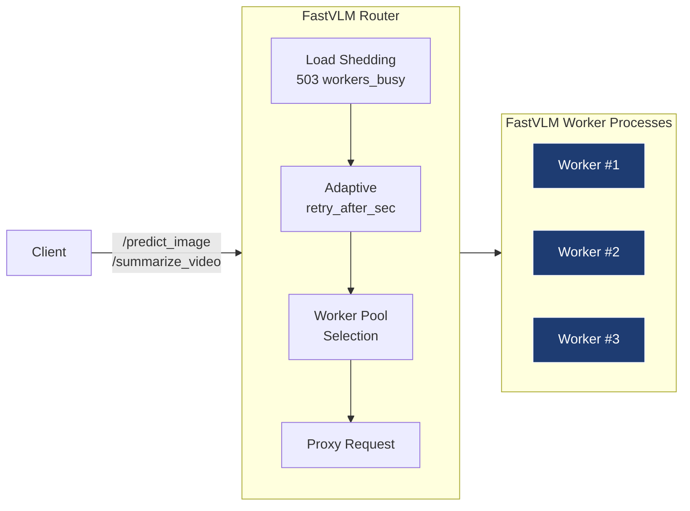
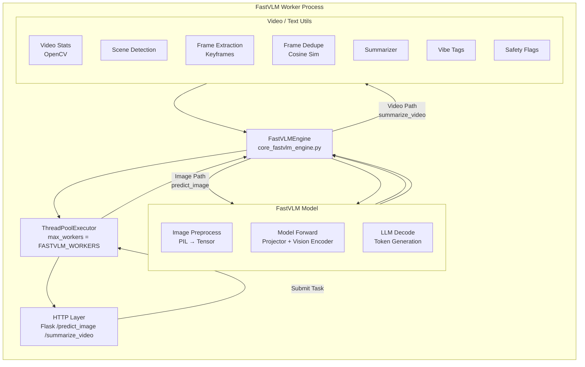

# 📦 **FastVLM AI Descriptor Engine**

**High-Performance Vision-Language Model Server for Image & Video Understanding**

---

## 🧭 Overview

The **FastVLM AI Descriptor Engine** is a high-throughput, multi-worker inference service that provides image and video understanding for downstream LLM pipelines.

It is built for:

* Social-media short-video analysis
* Creator engagement pipelines
* Comment classification
* Automated replies with creator tone
* Content understanding / metadata enrichment
* Faster LLM prompting with structured VLM context

The system is optimized for **GPU efficiency**, **parallel workload handling**, **adaptive load shedding**, and **predictable retry semantics**.

---

## 🏗 Architecture (High Level)



Each worker hosts:

* A full FastVLM model instance
* Video processing stack (scene detection, extraction, dedupe)
* Captioning + summary generation
* Safety/vibe tagging

## Worker Architecture — High-Level (Flowchart LR Style)


### Worker Image Pipeline (Flowchart LR)
```mermaid
flowchart LR

    subgraph Worker["FastVLM Worker - predict_image"]
        direction TB

        H[HTTP Layer /predict_image]
        EXEC[ThreadPoolExecutor]
        E[FastVLMEngine describe_image()]
        IMG[Load Image (PIL/OpenCV)]
        PRE[Preprocess (Tensorize)]
        MODEL[FastVLM Caption Generation]
        OUT[JSON Response]
    end

    H --> EXEC
    EXEC --> E
    E --> IMG
    IMG --> PRE
    PRE --> MODEL
    MODEL --> E
    E --> OUT
    OUT --> H

    classDef gpu fill:#1e3c72,stroke:#fff,color:#fff;
    class MODEL gpu;

```

### Worker Video Pipeline (Flowchart LR)
```mermaid
flowchart LR

    subgraph Worker["FastVLM Worker - summarize_video"]
        direction TB

        H[HTTP Layer\n/summarize_video]
        EXEC[ThreadPoolExecutor]
        E[FastVLMEngine\nsummarize_video()]

        subgraph VIDEO["Video Processing"]
            direction TB
            V1[Video Stats\nfps, duration]
            V2[Scene Detection]
            V3[Frame Extraction]
            V4[Frame Dedupe]
        end

        subgraph CAPTION["Frame Captioning"]
            direction TB
            C1[Convert to PIL]
            C2[Preprocess]
            C3[Model Caption]
        end

        SUM[Summarizer]
        TAGS[Safety / Vibe Tags]
        OUT[JSON Result]
    end

    H --> EXEC
    EXEC --> E

    %% video analysis
    E --> VIDEO
    VIDEO --> E

    %% per-frame captioning
    E --> C1
    C1 --> C2
    C2 --> C3
    C3 --> E

    %% summary
    E --> SUM
    SUM --> E

    %% tagging
    E --> TAGS
    TAGS --> E

    E --> OUT
    OUT --> H

    classDef gpu fill:#1e3c72,stroke:#fff,color:#fff;
    class C3 gpu;
```


Router is responsible for:

* Worker health
* In-flight concurrency limits
* Worker memory-aware spawning
* Load shedding + retry-after
* Proxying and result aggregation

---

## 🛠 **Current Features (v0.1.0)**

### **1. Multi-Worker FastVLM**

* Multiple worker processes per GPU host.
* Auto-spawned until VRAM & RAM thresholds reached.

### **2. VRAM + RAM Aware Worker Creation**

* Uses NVML + psutil.
* Prevents OOM and GPU thrashing.

### **3. Inflight Concurrency Control**

* Each worker has configurable `max_concurrent`.
* Router returns structured 503 when overloaded.

### **4. Adaptive Retry-After**

Router computes retry delay based on:

* Endpoint type (image/video)
* Total in-flight load
* Client retry attempt (`X-Retry-Attempt`)

### **5. Full Inference Pipelines**

#### `/predict_image`

* Single-image captioning
* Fast inference path

#### `/summarize_video`

* Scene detection
* Keyframe extraction
* Duplicate frame removal
* Per-frame captioning
* Multi-caption summarization
* Safety flags
* Vibe tags
* Timing block per stage

### **6. Robust Testing Suite**

* Parallel stress test for image
* Parallel stress test for video
* Timing tests
* Retry drain-down tests
* Error path coverage

### **7. Clean API**

* `/healthz`
* `/readyz`
* `/predict_image`
* `/summarize_video`

---

## 📡 API Endpoints

### **GET /healthz**

Returns current worker status.

### **GET /readyz**

Service readiness probe.

### **POST /predict_image**

```json
{
  "image_path": "/path/to/image.jpg",
  "prompt": "Describe the image"
}
```

### **POST /summarize_video**

```json
{
  "video_path": "/path/to/video.mp4"
}
```

---

## 🚦 Load Shedding Model

When router cannot find any worker with free concurrency slots:

```json
{
  "error": {
    "code": "workers_busy",
    "retry_after_sec": 22.5,
    "message": "All FastVLM workers are at max concurrency"
  }
}
```

Workers never take more load than they can safely handle.

Clients must retry with **exponential backoff**. A reference implementation is included.

---

## 🔁 Retry Model

The recommended retry behavior is:

1. Exponential backoff
2. Honor `retry_after_sec` if provided
3. Cap delays (60s video, 8s image)
4. Respect a global per-request timeout

Client tests include the correct logic.

---

## 🧪 Testing

Run:

```bash
python test_fastvlm_client.py
```

Includes:

* Unit tests
* Parallel image tests
* Parallel video tests
* End-to-end stress
* Retry-path draining
* Error-path validation

---

# 🚀 **Future Release Roadmap (2-Day Iterations)**

Below is the production roadmap broken into fast, 1–2 day deliverables.

Each release is independent and cleanly scoped.

---

## 🟦 **Release v0.2 — Worker Reliability & Heartbeats**

**Time:** 1–2 days
**Goal:** Self-healing worker pool

### Features

* Worker → `/worker_health` heartbeat
* Router detects dead workers
* Auto-respawn worker processes
* Quarantine workers with repeated failures

**Outcome:** System stays alive even under crashes or GPU resets.

---

## 🟩 **Release v0.3 — Logging + Metrics (Prometheus)**

**Time:** 1–2 days
**Goal:** Full visibility

### Features

* JSON structured logging
* Per-worker and per-request logs
* `/metrics` exposing:

  * inflight
  * worker states
  * GPU usage
  * request_duration_seconds
  * busy_rejections_total

**Outcome:** Monitoring + alerting become possible immediately.

---

## 🟧 **Release v0.4 — Unified Error Schema + API Keys**

**Time:** 1–2 days
**Goal:** Clean, stable external API

### Features

* Standard JSON error schema
* API key middleware
* Optional IP allowlist
* Test coverage for errors

**Outcome:** Safe for client applications + cloud edge.

---

## 🟥 **Release v0.5 — Multi-GPU Support**

**Time:** 1–2 days
**Goal:** Scale vertically across GPUs

### Features

* Discover all GPUs
* Worker pools per GPU
* Least-loaded GPU routing
* Per-GPU metrics

**Outcome:** Throughput increases linearly across GPUs.

---

## 🟪 **Release v0.6 — Optional Job Queue Mode**

**Time:** 2 days
**Goal:** Handle extreme burst loads

### Features

* `mode = queue` in config
* Router quickly returns `job_id`
* Workers pull jobs
* `/job/<id>` endpoint
* TTL purging

**Outcome:** Smooths spikes without hammering retry loops.

---

## 🟫 **Release v0.7 — Distributed Tracing (OpenTelemetry)**

**Time:** 1–2 days
**Goal:** Deep introspection

### Features

* Trace IDs across router + worker
* Spans for:

  * scene detection
  * frame extraction
  * dedupe
  * captioning
  * summary
* Export to Jaeger

**Outcome:** You can now pinpoint slowdowns instantly.

---

## 🟨 **Release v0.8 — Horizontal Scaling (Multi-Host)**

**Time:** 2 days
**Goal:** Cluster deployment

### Features

* Remote worker registry
* Router load-balancing across hosts
* Host tagging capability
* Multi-host stress tests

**Outcome:** Can scale to a *farm* of FastVLM workers across machines.

---

# 🔚 Conclusion

This README documents:

* The **current capabilities**
* The **architecture**
* The **API**
* The **testing approach**
* And a **realistic, 2-week roadmap** covering future releases

This makes the service production-viable and ready for integration into the larger creator-engagement platform (Seakrait + Pugsy AI).

